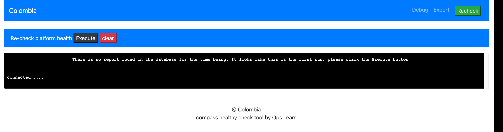
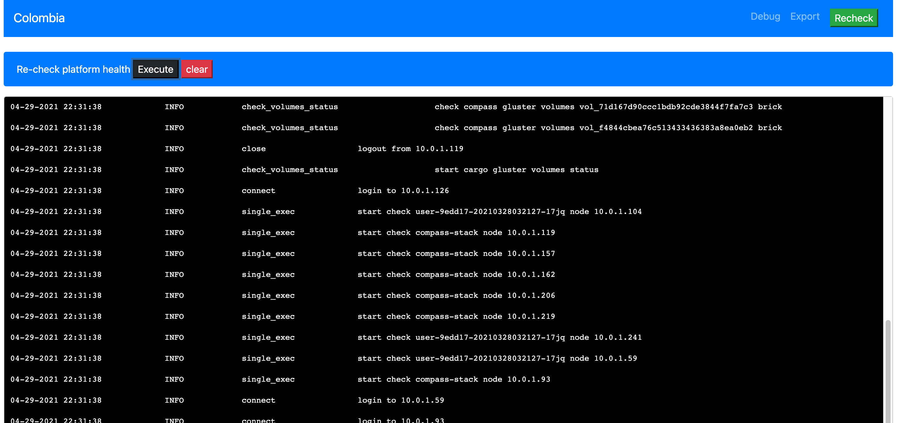
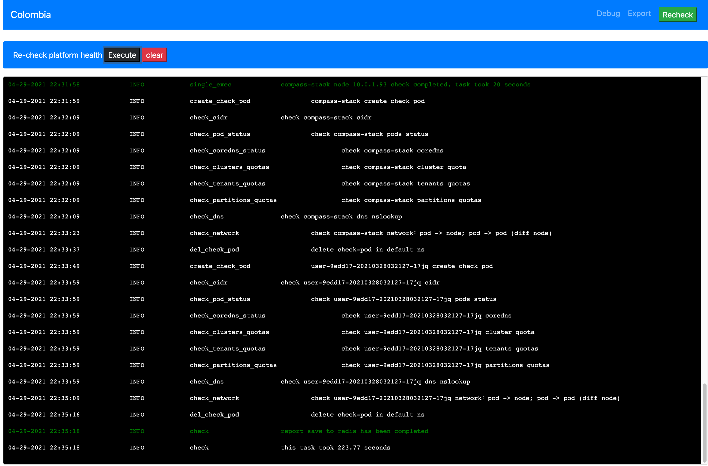
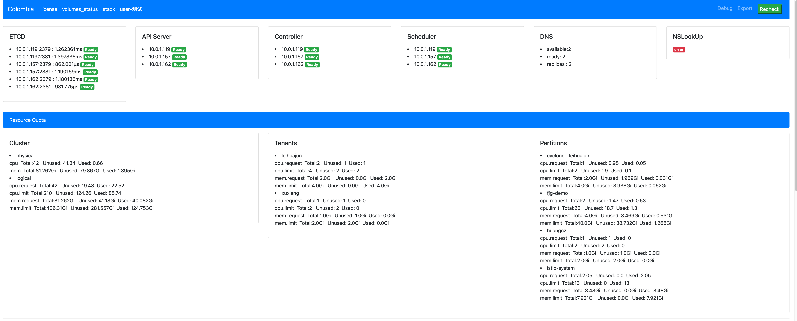
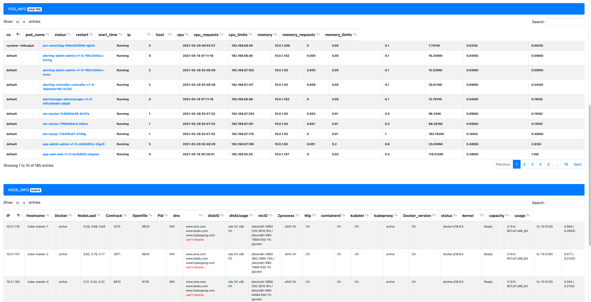
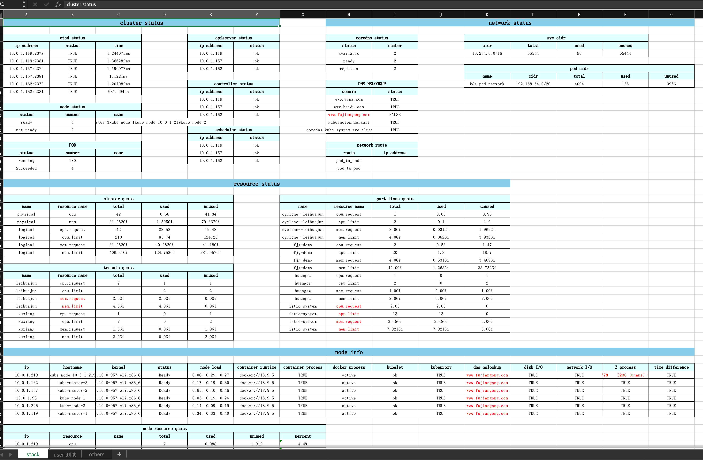

# Colombia

###  What's the meaning of this project name?

There is no special meaning, that is to say, Colombia is a country, because on the day of launching this project, 
I heard something about this country on the news, but I have forgotten the specific thing   (-_-) 


### What the tool does ？


We need to conduct regular inspection on the delivered customer environment. The inspection contents include the following

|  Component    | Check Item  |
|  ----  | ----           |       
| Core component |ETCD API Server Controller  Scheduler DNS       |
| Node  |  Docker Load Contrack Openfile DNS diskio diskusage nicio  NTP kubelet  kubeproxy  usage  .. etc              |        
|Pod    |  status start_time ip host resource metric ... etc          |  
|Gluster|   volume status              |
|License|   Remain days time Remain physical cpu            |

At the same time, we know the progress of the inspection in real time. We need to view the results of the inspection very
quickly. After the inspection, we also need to output the report according to the inspection situation. Here we will export
excel


### How to use 

1. Copy config.ini.sample to config.ini. Please refer to the following instructions for specific configuration
```ini

[kubernetes]
# Cluster type, used to distinguish compass control cluster and k8s community version. The values are: compass, default
k8s_type = compass

#If k8s_ If the type is compass, then k8s conf Path should be the configuration file that controls the cluster
k8s_conf_path = /compass/.kubectl.kubeconfig
# Tenant with platform administrator authority and password
admin_user_name = admin
admin_user_pwd = Pwd123456

# External domain name to be detected
externalDomain = www.sina.com www.baidu.com www.fujiangong.com
# Internal domain name to be detected
internalDomain = kubernetes.default coredns.kube-system.svc.cluster.local

# images repository
[cargo]
node_ip = 10.0.1.126
ssh_user = root
ssh_pwd = Caicloud@2020
ssh_port = 22
harbor_user = admin
harbor_pwd = Pwd123456


#Customer information, prefix field of output report
[info]
customer = compass
```

2. Prepare configmap
* config.ini  
* kubeconfig

3. load images to cargo 
* busybox

4. Publishing applications
* config.ini  ---> /app/config.ini
* kubeconfig ---> /compass/.kubectl.kubeconfig
* nodePort or ingress are OK

5. When you visit the app for the first time, you will be forced to jump to the check interface



click Execute button,Start the inspection task, and output the progress of the check in real time in the log window



After the completion of the test job, there will be a message prompt, and then you can view the inspection




6. Click the Export button to output the excel of the result of this inspection, with the title of customer name plus 
the execution time as follows
   



   


